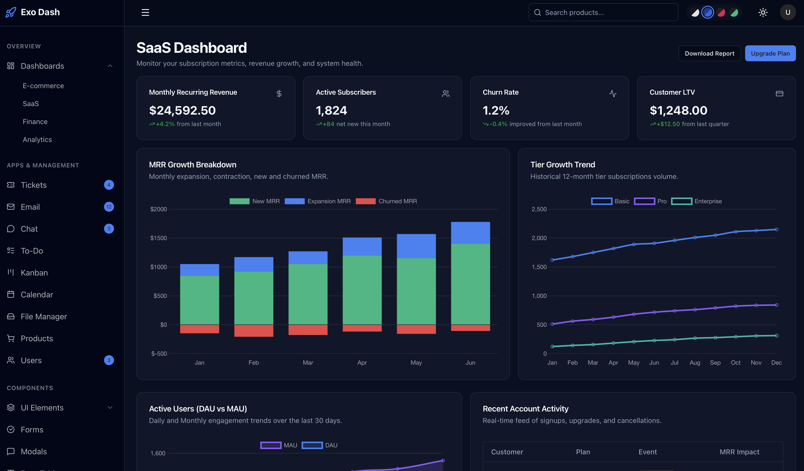

# Exo UI - React Dashboard Template



Welcome to **Exo UI**, a premium, beautifully crafted React dashboard template designed with developer experience in mind. It leverages the latest React 19 features alongside Tailwind CSS v4 for ultimate customizability.

> **🅰️ Looking for the Angular version?** 
> We also maintain a purely Angular version of this dashboard built with Standalone Components, Signals, and Functional Routing. **[Check out Exo UI Angular here](https://github.com/exouidev/exo-dash-angular)**.

📚 **[View the Official Documentation](https://exoui.dev/documentation)**

## 🚀 Setup Guide (React)

### 1. Prerequisites
Before you begin, ensure you have the following installed on your local machine:
- **Node.js**: `v18.13.0` or higher (we recommend using the latest LTS version).
- **npm** or **yarn** package manager.

### 2. Installation
To get started with the Exo UI template, navigate to your project folder and install the dependencies:

```bash
# Navigate to the project root
cd react-tailwind-dashboard-template

# Install NPM dependencies
npm install 
```

### 3. Running the Development Server
Exo UI comes pre-configured with a highly optimized Vite-based development server. To start local development:

```bash
npm run dev
```

Once the server has spun up, open your browser and navigate to:
**`http://localhost:5173/`**

The application features hot-module replacement (HMR), so it will automatically update in the browser whenever you modify source files.

### 4. Building for Production
When you're ready to deploy your application to a live server, run the production build command:

```bash
npm run build

```

This compiles the project ahead-of-time (AOT) and stores the minified, highly optimized build artifacts in the `dist/` directory.

### 5. Running Tests
Exo UI is configured to use **Vitest** for incredibly fast component and unit testing out of the box.

```bash
npm run test
```


---

## 📂 Directory Architecture Breakdown

Here is a breakdown of the project layout, defining where pages, components, and application state live:

- **`src/pages/` (Pages)**: This is where all the main application pages (e.g., dashboard, analytics, settings) reside.
- **`src/components/ui/` (Components)**: Reusable and presentational UI components (buttons, cards, tables, modals, etc.) shared across various feature modules.
- **`src/components/layout/`**: Contains the broad structural wrappers for the application, such as `app-shell` (the primary dashboard wrapper containing the sidebar and header) and `sidebar`.
- **`src/hooks/` (State)**: Houses application-wide generic React hooks. This is where central layout context and state management live (`use-sidebar.tsx`, `use-theme.tsx`).

## 🎨 Advanced Theming & Customization

Exo UI features a robust styling engine powered by Tailwind CSS v4 and native CSS variables. This creates a flexible system where updating a few core variables instantly trickles down to hundreds of UI components seamlessly.

### 1. The Design Token Architecture
In `src/styles.css`, you will find `@layer base` defining standard CSS variables under the `:root` selector. These variables map directly to dynamic Tailwind utility classes.
- For example, `--primary: #18181b;` enables you to use classes like `bg-primary`, `text-primary`, or `border-primary` inside your components.
- By tweaking these tokens, you can rapidly adapt the Exo UI template to perfectly match your unique brand identity.

### 2. Managing Dark Mode
Exo UI handles dark mode inverse color styling locally under the `.dark` class block inside `src/styles.css`.
When the HTML `dark` class is appended to the global document root, the variables automatically swap seamlessly:
```css
/* Typical Light Mode Setup */
:root {
  --background: #ffffff;
  --primary: #18181b;
}

/* Matching Dark Mode Setup */
.dark {
  --background: #09090b;
  --primary: #fafafa;
}
```

### 3. Creating Custom Theme Variants
Exo UI ships with four color variants out of the box (`zinc` default, `blue`, `rose`, `green`). 
Creating a new architectural theme is incredibly straightforward. Simply declare a brand new class globally in your stylesheet overriding the core UI tokens you wish to adjust.

```css
/* Custom Purple Theme */
.theme-purple {
  --primary: #9333ea;
  --ring: #9333ea;
}
.theme-purple.dark {
  --primary: #c084fc;
  --ring: #c084fc;
}
```

### 4. Interfacing with ThemeService
Central state management of the UI theme lives in `src/hooks/use-theme.tsx`. It strictly leverages modern **React Context Providers** to maintain absolute reactive sync with the browser's actual DOM and memory `localStorage`.

```tsx
import { useTheme } from '../hooks/use-theme';

export function SettingsComponent() {
  const { theme, setTheme, colorScheme, setColorScheme } = useTheme();

  const swapTheme = () => {
    // Toggles Light/Dark Mode
    setTheme(theme === 'dark' ? 'light' : 'dark');
    
    // Switch to a completely different color scheme palette
    setColorScheme('rose');
  }

  return <button onClick={swapTheme}>Change Theme</button>;
}
```

---

## 🏗️ Core Application Guidelines

To ensure your dashboard stays performant and maintainable during large-scale production extensions, we recommend adhering to Exo UI's leading architectural principles below.

### UI Component Sandbox 
- All generic presentational frontend components sit inside `src/components/ui/`. 
- Components (such as `<Card>` or `<Button>`) rely natively on standard React functional property mappings via interfaces.
- Always pass variant styles directly to components via the `variant` parameters hooking into `class-variance-authority` constraints rather than hard-coding business logic into shared elements.

### React Hook Forms API
Exo UI leverages the bleeding-edge `react-hook-form` API alongside `@hookform/resolvers` and `Zod` validation mechanisms for all user input pipelines natively.
- Forms are strongly typed, fully reactive, and incredibly lightweight avoiding redundant renders.
- See `src/pages/components/forms.tsx` for live configuration and setup examples of structured profile schemas.

### App Routing Ecosystem
Exo UI relies entirely on modern `react-router-dom` leveraging `<BrowserRouter>` mechanics without heavy routing metadata payloads.
- Open **`src/App.tsx`** to view and modify the primary routing tree structure.
- Application `<Layout />` structures are segregated securely at the router root via `Outlet`: the authentication layout wrapper (`AuthLayout`) operates completely isolated from the standard administrative (`AppShell`) dashboard environment.
